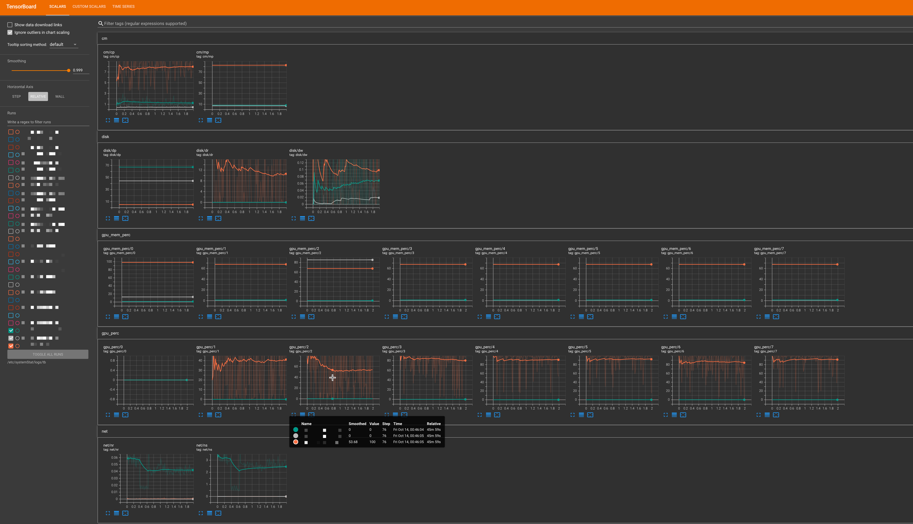

# systemStat
A simple B/S python program for collecting and displaying system information

## Demo


## Glossary
cm: cpu & memory
- cm/cp: cpu utilization percentage
- cm/cp: memory utilization percentage

disk: 
- disk/dp: disk utilization percentage
- disk/dr: disk read(MB/s)
- disk/dw: disk write(MB/s)

gpu_mem_prec: gpu memory utilization percentage
- gpu_mem_prec/0: gpu memory utilization percentage on gpu 0

gpu_perc: gpu utilization percentage
- gpu_perc/0: gpu utilization percentage on gpu 0

net: network
- net/nr: network read(MB/s)
- net/nw: network write(MB/s)

## How to use
### Set & Launch Server
1. clone or download the repo

2. Install requriments  
```shell
pip install -r requriments.txt
```

3. set server *config.py* 
    - server_host: your_hostname
    - server_port: pick_a_port
    - server_cyphertext: `echo -n your_plaintext | md5sum`
    - stat_log_dir: dir_to_save_infos(json/client/day)
    - tb_log_dir: dir_to_save_tensorboard_data
    - interval: send stats from client to server interval, minutes
4. launch server  
```shell
python main.py --server
```

### Set & Lanuch Tensorboard Server
```shell
# launch tensorboard server on background
python main.py --tb_server --bg
```
**Notice: server and tb_server should be launched on same machine**

### Set & Launch Client
```shell
# add a task on crontab
# notice: 
# 1. your planetext should same to the plaintext which convert(md5) to config.py server_cyphertext
# 2. the interval for send statics form client to server should same to config.py interval
* * * * * python3 /etc/systemStat/systemStat/main.py --client --plaintext your_planetext >> /etc/systemStat/logs/client.log 2>&1
```

## Acknowledgment
Thanks for [gpustat](https://github.com/wookayin/gpustat) great work!